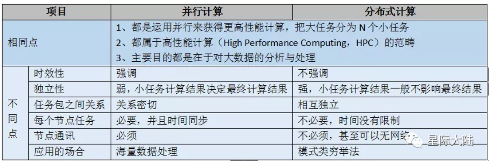
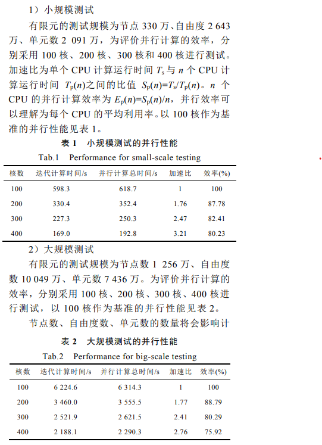

### 1.调研和说明`并行计算`、`分布式计算`、`云计算`的异同

- `并行计算`：又称平行计算，是指一种能够让多条指令同时进行的计算模式，可分为时间并行和空间并行。时间并行即利用多条流水线同时作业，空间并行是指使用多个处理器执行并发计算，以降低解决复杂问题所需要的时间。它将问题分成N多个子任务，每个子任务并行执行计算。而每个子任务是非独立的，每个子任务的计算结果决定最终的结果。
- `分布式计算`：主要研究分布式系统如何进行计算。分布式系统是一组计算机，通过计算机网络相互链接与通信后形成的系统，把需要进行大量计算的工程数据分区成小块，由多台计算机分别计算，在上传运算结果后，将结果统一合并得出数据结论的科学。

- `云计算`：不只是计算等计算机概念，还有运营服务等概念。它是`分布式计算`、`并行计算`和网格计算的发展，或者说是这些概念的商业实现。 `云计算`是从集群技术发展而来，区别在于集群虽然把多台机器联了起来，但其某项具体任务执行的时候还是会被转发到某台服务器上，而云可以简单的认为是任务可以被分割成多个进程在多台服务器上`并行计算`，然后得到结果。
- `云计算`与`并行计算`、`分布式计算`的区别，以计算机用户来说，`并行计算`是由单个用户完成的，`分布式计算`是由多个用户合作完成的，`云计算`是没有用户参与，而是交给网络另一端的服务器完成的。

*参考*：

<https://developer.baidu.com/article/detail.html?id=293312>
 
<https://www.cnblogs.com/pipci/p/12259985.html>
 

### 2.并行计算应用调研

并行计算方法在大规模电磁场计算领域的应用。

在高性能云平台的高速互联弹性集群上开展可扩展并行计算研究，使用 OpenMpi 作为消息传递库，选取的区域分解算法为对偶原始有限元撕裂内联（FETI-DP）法，通过改进主从/对等的并行程序框架实现电导率不变时涡流场磁矢势 A 的并行计算，在降低编程复杂度的同时提高了并行计算效率。

软硬件平台：计算机集群由 21 台双路 28 核心、128GB 内存的服务器组成。1 台作为管理节点（Master），负责计算任务的分发和调度，其余 20 台作为计算节点（Slaver）实现计算与存储。集群之间通过 Infiband 协议实现 30Gbit/s光纤互联。存储系统采用 Hadoop 分布式文件系统（Hadoop Distributed File System, HDFS）。。操作系统为 Red Hat 6.5，内核版本为 2.6.32-431.TH.x86_64。

运行测试结果（见文末）：

数值计算的加速比结果表明可扩展并行计算方法具有很好的可扩展性能和很高的并行计算效能。

*参考*

金 亮, 李育增, 杨庆新, 张 闯 , 闫 帅 《大规模工程电磁场的亿自由度可扩展并行计算方法》，电 工 技 术 学 报，2022 年 2 月 
第 37 卷第 3 期 

### 3.根据调研的应用需求，按预算1000万人民币购置计算设备，请给出采购清单（组件型号、数量、单价）

以上文的应用需求作为最低配置，根据预算1000万人民币增加处理器和内存等数量并购置计算设备，给出采购清单如下：

|项目|单价（元）|数量|总价（元）|
|:---:|:---:|:---:|:---:|
|Intel® Xeon® Gold 6558Q Processor|50000|100|5000000|
|Intel® Optane™ Persistent Memory 128GB Module (1.0) 4 Pack|11000|100|1100000|
|Samsung 970 EVO NVMe® M.2 SSD 2TB|4000|100|400000|
|互联网络，高效冷却系统等其他项目|||1000000|
|总计|||7500000|

|项目|类型|
|---|---|
|Operating System|Red Hat 6.5|
|并行程序通信|openMPI|
|内核版本|2.6.32-431.TH.x86_64|

