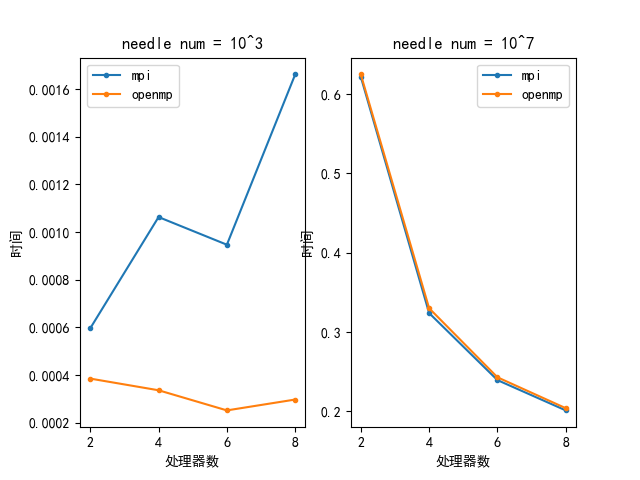

### 15.3

```c{.line-numbers}
float data[1024], buf[10];
for(int i = 0; i < 10; i++) buf[i] = data[32*i];
MPI_Send(buf, 10, MPI_FLOAT, dst, tag, MPI_COMM_WORLD);
```

### 15.13

#### 1

在$a=b=l=1$，针的数量为1000000的情况下，程序运行结果如下：模拟运行时间为0.126000s，$\pi=3.142062$，精确到小数点后两位


#### 2

针数为$10^3,10^4,10^5,10^6,10^7$，处理器数为$2,4,6,8$时，程序运行时间如下：

*mpi*:

|(处理器数，针数)->时间|$10^3$|$10^4$|$10^5$|$10^6$|$10^7$|
|:-:|:-:|:-:|:-:|:-:|:-:|
|2|0.000596|0.000683|0.006205|0.061909|0.621716|
|4|0.001063|0.000384|0.003112|0.032425|0.323915|
|6|0.000947|0.000344|0.002318|0.023835|0.239409|
|8|0.001662|0.000408|0.001864|0.019416|0.201228|

*openmp*:

|(处理器数，针数)->时间|$10^3$|$10^4$|$10^5$|$10^6$|$10^7$|
|:-:|:-:|:-:|:-:|:-:|:-:|
|2|0.000385|0.000673|0.006805|0.062617|0.624714|
|4|0.000336|0.000448|0.003639|0.035880|0.330013|
|6|0.000251|0.000396|0.003239|0.024227|0.242950|
|8|0.000297|0.000450|0.002242|0.020388|0.204005|

针对针数$10^3,10^7$，由上表数据可得程序运行时间与所用处理器数关系图如下：



由图可以看到，当针数为$10^3$时，程序运行时间并不随处理器增加而近似线性减少，会出现较大波动，甚至当处理器较多时，程序运行时间反而增加，此时可扩展性差。而当针数为$10^7$时，程序运行时间随处理器增加而近似线性减少，可扩展性较好。

因为当针数为$10^3$时，程序运行时间较短，实际计算的时间在总时间开销中并不占主导地位，处理器数增加减少的计算时间很可能不如其增加的通信开销等，导致程序运行时间增加。而当针数为$10^7$时，程序运行时间较长，处理器数增加会减少计算时间，远大于处理器数增加引起的通信开销的增加，导致程序运行时间减少。