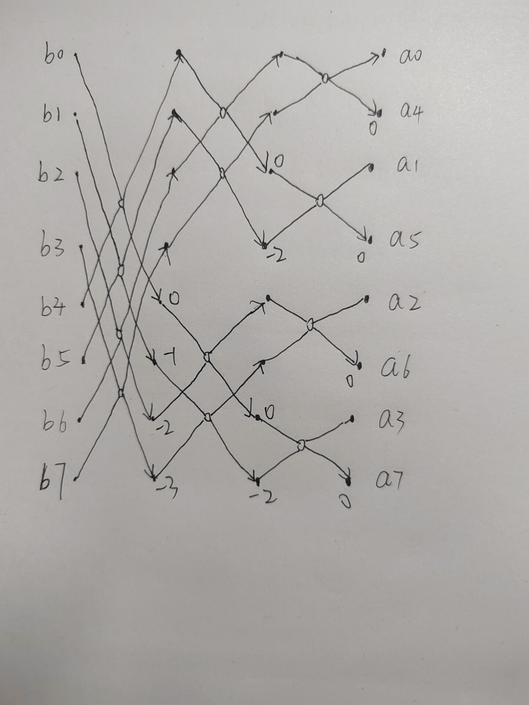

### 10.6

第一阶段时间：$T(1)=\Theta(n/p)$

$T(MAX.TOURNAMENT)=\Theta(p)$

$T(HC.BROADCAST)=\Theta(p)$

第二阶段时间：$T(2)=\Theta(n(n/p+p+n+p+n^2/p))=\Theta(n^2/p+np+n^2+n^3/p)$

第三阶段时间：$T(3)=\Theta(n/p)$

总时间：$T=\Theta(n^2/p+np+n^2+n^3/p+n/p)$

### 11.5

```c{.line-numbers}
Begin
	for k=0 to n-1 do
		c_k = a_k
	endfor
	for h = logn-1 to 0 do
		p = 2^h
		q = n/p
		z = w^(q/2) 
		for k=0 to n-1 do
			if(k mod p == k mod (2p)) then
				c_k_temp = c_k
				c_k = c_k + c_{k+p} // 将 c_{k+p} 加到 c_k 上
				c_{k+p} = (c_k_temp - c_{k+p})z^{k mod p} 
			endif
		endfor
	endfor
	for k=0 to n-1 do
		b_{r(k)} = c_k  // r(k)表示对k按位取反
	endfor
End

```

